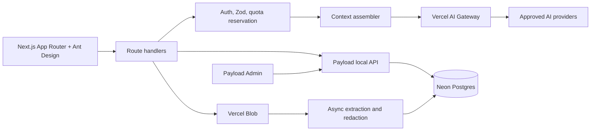

# HHT AI Chat Architecture

## Product boundary

The first release is an educational chat helper for people living with hereditary
hemorrhagic telangiectasia (HHT). It must not diagnose, prescribe, change treatment,
or present itself as an emergency service. Any later clinical decision-support
feature requires separate medical, legal, and regulatory review.

The implementation is intentionally incremental. The current slice is a stateless,
streaming chat with a safety prompt and no medical-document upload.

## Target system

### Runtime choices

- **Application and CMS:** one Next.js 16+ App Router deployment with Payload CMS.
  Payload's Local API is used server-side; its REST API is not exposed for patient data.
- **Database:** Neon Postgres provisioned through the Vercel Marketplace and connected
  through `@payloadcms/db-postgres`. Use the pooled URL at runtime and a direct URL for
  migrations when Neon supplies both.
- **UI:** Ant Design with `@ant-design/nextjs-registry`; CSS Modules and global CSS only.
  Tailwind is not part of the project.
- **AI:** Vercel AI SDK through Vercel AI Gateway. The client can select only an
  admin-approved model profile, never an arbitrary model identifier or credential.
- **Files:** Vercel Blob for encrypted-at-rest objects. Do not use the Vercel function
  filesystem for uploaded medical records.
- **Validation:** Zod at every untrusted boundary. Payload field validation remains the
  second, persistence-level boundary.
- **Tests:** Vitest for domain and component tests; Playwright for user journeys.

## Planned Payload model

| Collection         | Purpose and critical rules                                                                    |
| ------------------ | --------------------------------------------------------------------------------------------- |
| `admin-users`      | Payload Admin access only; role-based access and MFA before production.                       |
| `patients`         | Patient profile, status, consent versions, locale, and default usage policy. No admin access. |
| `auth-identities`  | Unique VK/Yandex provider subject linked to one patient.                                      |
| `login-codes`      | Hashed email OTP, short expiry, attempt count, one-time consumption.                          |
| `sessions`         | Hashed session token, expiry, device metadata, and revocation timestamp.                      |
| `chats`            | Owner, title, selected model profile, and optional context-space reference.                   |
| `chat-access`      | Owner/editor/viewer grants; accepted grants are checked on every read and write.              |
| `chat-invitations` | Normalized email, hashed invitation token, expiry, inviter, and single-use state.             |
| `messages`         | Chat, role, content parts, model metadata, safety flags, and immutable timestamps.            |
| `context-spaces`   | Explicit opt-in boundary for context shared across chats.                                     |
| `documents`        | Owner, Blob key, MIME type, checksum, extraction state, retention date, and consent snapshot. |
| `document-chunks`  | Redacted text, source offsets, embedding, and document ownership metadata.                    |
| `model-profiles`   | UI name, gateway model ID, enabled state, safety policy, and credential reference.            |
| `ai-credentials`   | Encrypted BYOK material and key version; never returned through Payload APIs.                 |
| `usage-policies`   | Request/token limits by period and permitted model profiles.                                  |
| `usage-ledger`     | Reserved and settled input/output tokens, cost, status, user, chat, and request id.           |
| `audit-events`     | Append-only security and administrative events without prompt content.                        |

All patient-owned collections deny access by default. Access functions must scope every
query by the authenticated patient or an accepted `chat-access` grant. Payload Admin
roles do not automatically grant production support staff access to medical content.

## Request flow

1. Authenticate the session and resolve the patient.
2. Parse the request with Zod and reject oversized message histories or files.
3. Verify chat access and the selected `model-profile`.
4. Reserve estimated usage in a serializable Neon transaction. This prevents concurrent
   requests from exceeding a hard user limit.
5. Build context from the current chat. Add a `context-space` only when the patient has
   explicitly enabled cross-chat context.
6. Retrieve only chunks owned by the patient and permitted for that context.
7. Send the minimum necessary context through AI Gateway, tagged with a pseudonymous
   user identifier and feature name.
8. Stream the response. On completion, persist the message and settle the reservation
   with actual token usage. Release or expire failed reservations.

No personalized chat response should be cached at the edge.

## Authentication design

- VK and Yandex use OAuth 2.0 authorization code flow with PKCE, strict redirect URI
  allowlists, `state`, and `nonce` where supported.
- Email login codes are random, short-lived, stored only as hashes, single-use, and
  protected by per-email and per-IP throttles.
- A successful provider login maps to `auth-identities`; provider email addresses are
  not silently merged without proof of ownership.
- Sessions use opaque, rotated tokens in `HttpOnly`, `Secure`, `SameSite=Lax` cookies.
- Payload admin authentication remains separate from patient authentication.

## Sharing and cross-chat context

Sharing is invitation-based. Emails contain only a neutral invitation and never a chat
title, message, diagnosis, or document name. The invitation token is stored as a hash.
Revocation takes effect immediately.

Cross-chat context is represented by an explicit `context-space`. Chats are isolated by
default. The UI must show which chats and documents contribute context and allow the
patient to detach or delete them. Context is never shared merely because two chats have
the same owner.

## Medical document pipeline

Uploads are a later phase:

1. Validate type, size, checksum, and malware scan result.
2. Store the original in a private Blob object.
3. Extract text asynchronously with idempotent jobs.
4. Detect and redact unnecessary identifiers before model processing.
5. Keep source offsets so every extracted statement can link back to the document.
6. Chunk and embed into Neon `pgvector`; filter retrieval by owner and context-space
   before vector similarity is evaluated.
7. Apply explicit retention and deletion policies to originals, derivatives, and
   embeddings.

Model output must distinguish document-derived facts from general information and cite
the source document and page where possible.

## AI credentials and limits

OIDC-authenticated Vercel AI Gateway is the default and avoids provider keys in the
application database. If administrators must add BYOK credentials, store envelope-
encrypted ciphertext only, with the master key held outside Neon. Payload hooks redact
the field on every read and write an audit event on create, rotate, or revoke.

Limits are enforced in the application ledger, not only in the provider dashboard:

- requests per minute;
- input, output, and total tokens per day/month;
- concurrent requests;
- allowed model profiles;
- optional monetary budget.

Gateway limits are a second guardrail. A failed or interrupted stream still produces a
settlement record.

## Security and privacy baseline

- Treat all medical documents and chat content as sensitive health data.
- Encrypt in transit and at rest, minimize prompt content, and disable provider training
  and prompt logging where contractual controls permit.
- Never put raw medical content, email addresses, access tokens, or OTPs in application,
  analytics, or audit logs.
- Define data residency, backup, export, erasure, incident-response, and vendor DPA
  requirements before accepting real patient records.
- Complete the applicable legal assessment (for example GDPR and/or Russian 152-FZ,
  depending on users and hosting). Vercel, Neon, or encryption alone does not establish
  compliance.
- Add prompt-injection defenses for documents: retrieved text is untrusted data and
  cannot override system policy or access checks.

## Delivery phases

### Phase 0 — current: simple chat

- Stateless streaming chat.
- Ant Design responsive UI.
- Zod request validation and bounded history.
- HHT educational safety prompt and emergency warning.
- Vercel AI Gateway model selected by server configuration.
- Vitest validation tests and Playwright smoke test.

### Phase 1 — identity, persistence, and quotas

- Patient/admin separation, VK, Yandex, and email OTP.
- Chats and messages in Payload/Neon.
- Admin-approved model profiles, usage policies, reservation ledger, and audit events.
- Authorization and quota integration tests.

### Phase 2 — controlled sharing and context

- Email invitations, roles, revocation, and recipient onboarding.
- Explicit context-spaces and a context provenance UI.
- Cross-tenant and revoked-access security tests.

### Phase 3 — medical documents and grounded answers

- Private upload, scanning, extraction, redaction, retention, and deletion.
- `pgvector` retrieval with ownership filters and source citations.
- Adversarial document and prompt-injection tests.

### Phase 4 — production hardening

- Privacy/legal sign-off, threat model, disaster recovery, observability, support access
  controls, accessibility audit, load tests, and clinical content review.

Each phase is deployable and testable without requiring the following phase.
