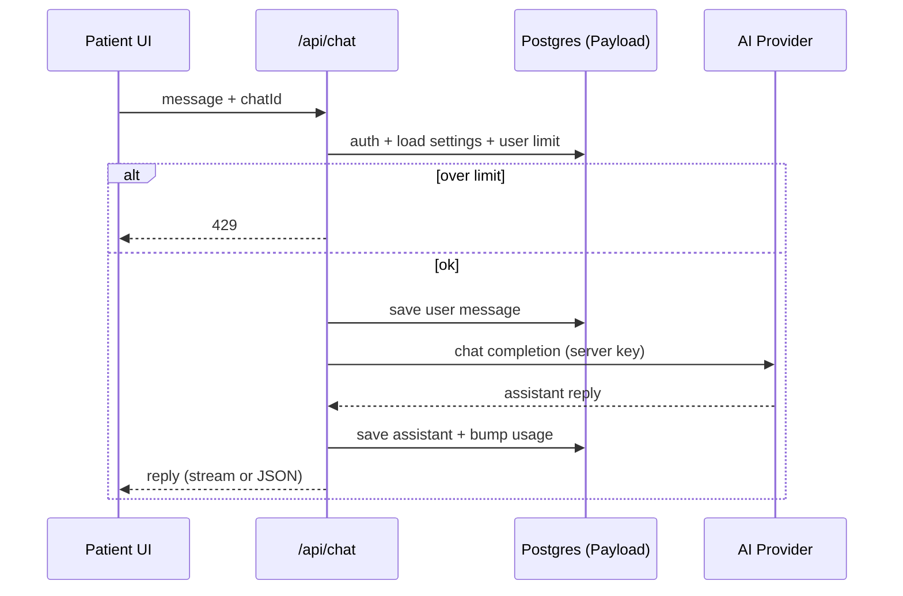

# Tech Spec: HHT Patient AI Chat

> Agent brief: implement patient chat against admin-configured AI provider; persist history; enforce per-user limits; PDF export. Stack: Next.js 16 App Router, Payload 3, Postgres. No code in this doc.

## Goal

HHT patients consult an AI about symptoms, treatment, tests, lifestyle. Admins configure the AI API key and per-user message/token limits. History is stored and downloadable as PDF.

## Out of scope (v1)

- Medical diagnosis claims / clinical decision support certification
- Multi-provider failover UI
- Real-time voice
- Shared/family accounts
- Mobile native apps

## Assumptions

| #   | Assumption                                                              |
| --- | ----------------------------------------------------------------------- |
| A1  | Payload auth: `users` = patients + admins (`role` field)                |
| A2  | Single AI provider key (admin-set; stored encrypted / server-only)      |
| A3  | Limit = countable units admin defines (default: **messages per month**) |
| A4  | Chat UI is authenticated frontend route (not Payload admin)             |
| A5  | Postgres via existing `@payloadcms/db-postgres`                         |
| A6  | Responses include a fixed medical disclaimer                            |

## Roles

| Role      | Can                                                                           |
| --------- | ----------------------------------------------------------------------------- |
| `admin`   | Set AI API key, set default + per-user limits, view usage; full Payload admin |
| `patient` | Chat, list own threads, download own thread PDF                               |

## Data model (Payload collections)

### `users` (extend)

| Field              | Type                         | Notes                                 |
| ------------------ | ---------------------------- | ------------------------------------- |
| `role`             | select: `admin` \| `patient` | default `patient`                     |
| `messageLimit`     | number \| null               | override; null → global default       |
| `messagesUsed`     | number                       | reset monthly (or track period start) |
| `limitPeriodStart` | date                         | period for usage reset                |

### `ai-settings` (globals preferred)

| Field                 | Type                   | Notes                                                   |
| --------------------- | ---------------------- | ------------------------------------------------------- |
| `provider`            | select (e.g. `openai`) | v1: one provider                                        |
| `apiKey`              | text                   | **never** expose to client; encrypt at rest if possible |
| `model`               | text                   | e.g. `gpt-4.1`                                          |
| `defaultMessageLimit` | number                 | applied when user has no override                       |
| `systemPrompt`        | textarea               | HHT-focused consult prompt + disclaimer rules           |

### `chats`

| Field    | Type                           | Notes                   |
| -------- | ------------------------------ | ----------------------- |
| `user`   | relationship → users           | owner                   |
| `title`  | text                           | auto from first message |
| `status` | select: `active` \| `archived` |                         |

Access: patient read/create/update **own** only; admin all.

### `messages`

| Field        | Type                                      | Notes                     |
| ------------ | ----------------------------------------- | ------------------------- |
| `chat`       | relationship → chats                      |                           |
| `role`       | select: `user` \| `assistant` \| `system` |                           |
| `content`    | textarea                                  |                           |
| `tokenCount` | number \| optional                        | if provider returns usage |

Access: via parent chat ownership.

## Data flow

### Chat turn

```
Patient UI
  → POST /api/chat  { chatId?, content }
  → Auth (Payload session)
  → Load ai-settings (server)
  → Check user limit (messagesUsed < effectiveLimit)
      ├─ over limit → 429 + message
      └─ ok
  → Persist user message → messages
  → Call AI provider (apiKey server-side only)
  → Persist assistant message → messages
  → Increment messagesUsed
  → Stream/return assistant text → UI
```



### Admin config

```
Admin (Payload UI)
  → Update ai-settings global (apiKey, model, defaultMessageLimit, systemPrompt)
  → Optionally set users.messageLimit
```

### PDF export

```
Patient UI
  → GET /api/chats/:id/pdf
  → Auth + ownership check
  → Load chat + messages (ordered)
  → Render PDF server-side
  → Content-Disposition: attachment
```

## API surface (App Router)

| Method             | Path                 | Auth    | Purpose                                                |
| ------------------ | -------------------- | ------- | ------------------------------------------------------ |
| `POST`             | `/api/chat`          | patient | Send message; create chat if needed; stream/JSON reply |
| `GET`              | `/api/chats`         | patient | List own chats                                         |
| `GET`              | `/api/chats/:id`     | patient | Chat + messages                                        |
| `GET`              | `/api/chats/:id/pdf` | patient | Download PDF                                           |
| Payload REST/Admin | `/admin`, `/api/*`   | admin   | Users, globals, inspect chats                          |

Do **not** put `apiKey` in any client bundle or public endpoint.

## Frontend (minimal)

| Route        | Purpose                             |
| ------------ | ----------------------------------- |
| `/login`     | Patient login (Payload auth)        |
| `/chat`      | Thread list + active conversation   |
| `/chat/[id]` | Resume thread; PDF download control |

UI needs: message list, composer, remaining quota indicator, disclaimer banner, download PDF.

## Limits

- Effective limit = `user.messageLimit ?? ai-settings.defaultMessageLimit`
- On each successful user→assistant turn: `messagesUsed++`
- When `messagesUsed >= effectiveLimit`: reject new user messages
- Reset: monthly cron or on first request after `limitPeriodStart + 1 month`

## Safety / product rules

- System prompt: HHT education only; urge professional care for emergencies; no definitive diagnosis
- Always show disclaimer in UI and in PDF footer
- Log provider errors server-side; show generic client error
- Rate-limit `/api/chat` per user (defense in depth)

## Implementation order (agent plan)

1. Extend `users` with `role`, limit/usage fields; seed admin vs patient access
2. Add `ai-settings` global; lock field access to admin
3. Add `chats` + `messages` collections + ownership access control
4. Implement `POST /api/chat` (limit check → persist → provider → persist → usage)
5. Patient chat UI (`/chat`, `/chat/[id]`)
6. `GET /api/chats/:id/pdf` + download button
7. Monthly usage reset (cron route or lazy reset)
8. Tests: limit enforcement, ownership, PDF auth, key never leaked

## Acceptance criteria

- [ ] Patient can send/receive HHT consult messages when under limit
- [ ] Over-limit patient gets clear blocked state; no provider call
- [ ] Admin can set API key + default/per-user limits in Payload
- [ ] API key never returned to browser
- [ ] Chat history persists; patient sees own history only
- [ ] Patient downloads own chat as PDF with disclaimer
- [ ] Admin cannot be required for day-to-day patient chat

## Open decisions (resolve before/during impl)

| ID  | Question                                     | Default if unset                                   |
| --- | -------------------------------------------- | -------------------------------------------------- |
| D1  | Limit unit: messages vs tokens?              | messages/month                                     |
| D2  | Stream responses vs full JSON?               | stream (UX)                                        |
| D3  | Which PDF lib?                               | `@react-pdf/renderer` or `pdfkit`                  |
| D4  | Encrypt apiKey at rest vs env-only fallback? | Payload field + server-only; env override OK       |
| D5  | Patient self-registration vs admin invites?  | admin creates patients (safer for medical context) |

## File touch map (expected)

```
src/payload.config.ts          # register globals/collections
src/collections/Users.ts       # role, limits
src/collections/Chats.ts       # new
src/collections/Messages.ts    # new
src/globals/AiSettings.ts      # new
src/app/(frontend)/chat/**     # UI
src/app/api/chat/route.ts      # chat turn
src/app/api/chats/**           # list/detail/pdf
src/lib/ai/**                  # provider client, limit helpers
docs/tech-spec-patient-ai-chat.md
```
